<p align="center">
  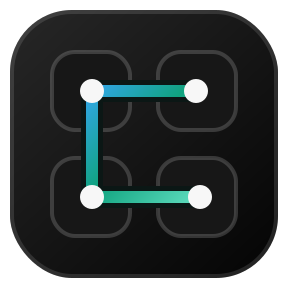
</p>

<h1 align="center">ThreadDeck for Codex</h1>

<p align="center"><strong>Stream Deck Neo용 오픈소스 Codex Stream Deck 플러그인.</strong></p>

<p align="center">
  Codex Desktop 작업을 실시간으로 보고, 로컬·원격 작업을 전환하고, Effort와 Fast mode를 조절하고,<br>
  작업 버튼을 누른 채 말해 후속 요청까지 보내는 macOS용 로컬 우선 물리 대시보드입니다.
</p>

<p align="center">
  <a href="https://github.com/y5862000/threaddeck-for-codex/releases"></a>
  <a href="https://github.com/y5862000/threaddeck-for-codex/actions/workflows/ci.yml"></a>
  <a href="LICENSE"></a>
  
  
  
</p>

<p align="center"><a href="README.md">English (기본)</a> · <strong>한국어</strong> · <a href="docs/INSTALL.ko.md">설치</a> · <a href="#길게-누르면-달라지는-버튼">제스처</a> · <a href="https://github.com/y5862000/threaddeck-for-codex/releases">다운로드</a></p>

ThreadDeck은 Stream Deck Neo를 Codex의 물리 작업 모니터이자 컨트롤러로 바꿉니다. [Codex Micro](https://github.com/mpociot/codex-micro-stream-deck-emulator)가 보여준 소형 하드웨어 에이전트 흐름에서 영감을 받았고, 이제 연결 가능한 경우 Codex 자체 Micro 렌더러 이벤트를 우선 사용합니다. 독립적인 8개 작업 모니터·렌더러·검증형 macOS 어댑터는 그대로 유지하므로 Micro 연결이 없거나 바뀐 Codex에서도 안전하게 기존 방식으로 폴백합니다.

기능 개요와 제스처 GIF는 개인정보 없는 예시 작업을 사용해 실제 SVG 버튼 렌더러에서 생성합니다. Reddit과 해외 커뮤니티 공유를 위해 저장소 미디어는 영어를 기본으로 만들고, 같은 플러그인은 Stream Deck 앱 언어가 한국어일 때 액션 이름과 버튼 UI를 자동으로 한국어로 바꿉니다. 별도 한국어 설치 파일은 없습니다.

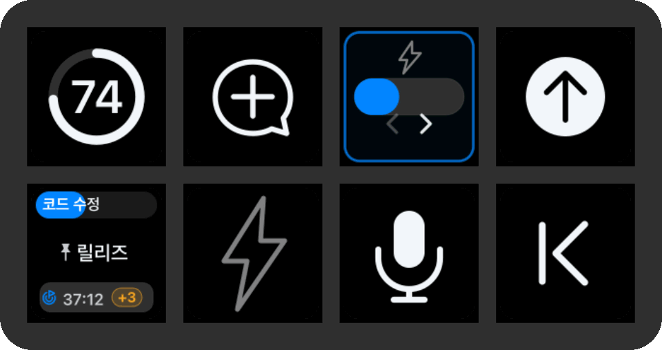

> [!IMPORTANT]
> ThreadDeck은 Codex의 공개되지 않은 로컬 메타데이터와 로컬 렌더러 API를 읽는 독립 베타입니다. Codex 업데이트 뒤 어느 경로든 일시적으로 깨질 수 있습니다. Codex 데이터베이스와 세션 파일에는 절대 쓰지 않습니다.

## 책상 위에 놓이는 기능

- **실시간 작업 카드** — 현재 단계, 제목, 고정 여부, 대기 개수, 목표 배지와 목표 전체 진행 시간, 추론 강도, 고속·일반 서비스 단서.
- **안전한 작업 전환** — 로컬 작업은 바로 열고, 직접 고정한 원격 작업은 마우스 포인터를 움직이거나 클릭하지 않고 올바른 컴퓨터까지 활성화합니다.
- **물리 버튼 음성 입력** — 작업 버튼을 누른 채 말해 자동 제출하거나, 전용 마이크로 검토할 초안만 남깁니다.
- **완료 피드백** — 대기 후속 요청이 없는 마지막 턴의 새 종료값이 확인된 뒤에만 화면의 모든 ThreadDeck 소유 버튼이 첫 완료 프레임을 함께 표시합니다. 이후 해당 작업 버튼은 그 작업을 실제로 열거나 Codex 전면에서 확인할 때까지 느린 초록 펄스를 계속 냅니다. 대기 명령 수정이나 실행 순서로의 전환은 완료로 세지 않습니다.
- **작업 흐름 제어** — 현재 모델의 추론 강도 조절, Codex Fast mode 전환, 새 작업, 사이드챗, 보내기, 앱 전환, 페이지 이동, 미디어 키, 선택 기능인 주간 한도 링.
- **Micro 우선 안정성** — Effort, Fast, 사이드챗, 누르는 동안 말하기, 보내기, 새 작업, Micro 기본 슬롯 6개는 Codex 내부 명령을 먼저 사용합니다. 8개 작업 대시보드와 지원되지 않는 빌드에는 검증된 손쉬운 사용·단축키 폴백을 유지합니다.

## 60초 설치

### 준비물

| 항목 | 지원 범위 |
|---|---|
| macOS | 13 이상 |
| Stream Deck | 7.4 이상 |
| 장치 | Stream Deck Neo |
| Mac 아키텍처 | Apple silicon, Intel |
| Codex | 번들 ID가 `com.openai.codex`인 Codex Desktop |
| 선택 기능인 한도 버튼 | CodexBar; 현재 macOS 14 이상 필요 |

### 설치 순서

1. [릴리스 페이지](https://github.com/y5862000/threaddeck-for-codex/releases)에서 `com.yechan.threaddeck.streamDeckPlugin`을 받아 두 번 클릭합니다.
2. 설치된 **ThreadDeck for Codex** 프로필을 선택하고 **시스템 설정 → 개인정보 보호 및 보안 → 손쉬운 사용**에서 **Stream Deck**을 허용한 뒤 Stream Deck을 다시 엽니다.
3. Codex를 한 번 종료하고 다시 엽니다. 설치할 때 이미 열려 있던 Codex는 ThreadDeck이 건드리지 않으며, 다음 정상 실행 뒤 임의의 `127.0.0.1` 렌더러 연결을 붙이기 위해 Codex가 한 번만 자동 재실행될 수 있습니다.
4. 기존 방식 폴백을 위해 아래 Codex 단축키 3개를 확인하고 마이크 버튼을 시험합니다.

설치 파일 하나에 편집 가능한 Neo 프로필, Apple Silicon/Intel 공용 헬퍼, 영어/한국어 현지화가 모두 들어갑니다. 화면별 설치 방법과 업데이트·삭제·읽기 전용 진단 명령은 [다른 Mac에 설치하기](docs/INSTALL.ko.md)를 확인하세요.

| Codex 기능 | 기존 방식 폴백 단축키 | 사용하는 버튼 |
|---|---:|---|
| 받아쓰기 시작 | `⌃⇧D` | 전용 마이크, 작업 버튼 길게 누르기 |
| 프로젝트 밖에 새 작업 열기 | `⌥⌘O` | 새 작업 버튼 |
| 사이드챗 열기 | `⌥⌘S` | 사이드챗 버튼 |

Micro 연결이 활성화되면 이 기능들은 Codex 내부 명령을 사용하므로 단축키를 보내지 않습니다. 폴백 경로에서는 라틴 `D`를 명시해 보내므로 2벌식 한글을 비롯한 비라틴 입력 소스에서도 받아쓰기를 시작합니다. 버튼을 놓을 때는 현재 Codex의 화면 음성 입력 중지 컨트롤을 검증해 활성화합니다.

## 버튼을 누르는 방법

`길게 누르기`와 `누르는 동안 말하기`는 서로 다릅니다.

- **작업 버튼**과 **보내기 버튼**은 정해진 시간까지 기다린 뒤 보조 동작이 준비됩니다.
- **전용 마이크 버튼**은 누르는 즉시 녹음을 시작하며 말하는 동안 계속 누르고 있어야 합니다.
- 나머지 **ThreadDeck 소유** 기본 버튼은 한 가지 동작만 가집니다. 미디어 페이지의 Elgato 소유 앱 실행 버튼 4개는 예외로, 짧게 누르면 앱을 열거나 앞으로 가져오고 길게 누르면 종료합니다.

| 버튼 | 누를 때 | 길게 누르거나 놓을 때 |
|---|---|---|
| 현재 작업 | Codex 앱의 활성 창에서 선택된 작업 열기 | **0.55초** 이상 누르면 해당 작업에서 음성 입력 시작; 놓으면 받아쓰기, 자동 제출, 작성창 초기화 확인 |
| 상위 작업 1~8 | 정렬된 로컬·고정 원격·사이드챗 목록에서 해당 순번의 작업 열기를 시작 | **0.55초** 이상 누르면 해당 작업에서 음성 입력 시작; 놓으면 받아쓰기, 자동 제출, 작성창 초기화 확인 |
| 전용 마이크 | 확인된 현재 작성창에서 음성 입력을 시작하고 지원되는 오디오 출력 미디어 앱을 잠시 멈춤 | 새 사이드챗은 작업 UUID가 생기기 전에도 확인된 오른쪽 작성창을 사용 가능; 말하는 동안 계속 누르고 놓으면 미디어를 재개하며 초안만 남김 |
| 보내기 | 현재 작성창을 확인하고 0.6초 전에 놓으면 Return | 작업·사이드챗 전환 중이면 새 작성창을 기다림; **0.6초**가 되면 파란색으로 전환되고 놓으면 Command+Return |
| 앱 실행 | 짧게 누르면 지정 앱을 열거나 앞으로 가져옴 | 길게 누르면 해당 앱 종료; 임계 시간과 실제 그림은 Stream Deck이 관리 |
| 주간 한도 | — | 놓으면 CodexBar 값을 즉시 새로 고침 |
| 새 작업 / 사이드챗 | — | Codex의 `NEW` / `PARTY` 내부 명령을 우선 사용하고 Micro가 없을 때 `⌥⌘O` / `⌥⌘S`로 폴백. 사이드챗은 보호된 식별 임대를 유지하며 전용 마이크만 임시 작성창 연결을 사용 |
| 추론 강도 + Fast | 0.6초 전에 놓으면 다음 응답 단계(`LIGHT`–`ULTRA`)로 이동하며 첫 클릭부터 트랙이 부드러운 320ms 전환을 시작 | 연타는 마지막 왕복 위치 하나로 합칩니다. 일반 노출 단계는 90ms만 기다린 뒤 Micro 노브와 같은 내부 작성창 명령으로 적용합니다. `Max`·`Ultra` 또는 노브가 건너뛴 단계는 입력이 1.1초 멈춘 뒤 정확한 `Advanced`를 열고 현재 계정·모델에 실제 보이는 목록을 스캔해 요청 단계만 선택합니다. Codex에서 직접 바꾼 값도 같은 애니메이션으로 반영합니다. 정확한 Ultra 경고에서는 `Use Full access`만 선택하고 `Continue`는 누르지 않습니다. **0.6초**가 되면 Codex 내부 Fast 명령을 즉시 실행하며 작은 번개는 검증된 속도를 표시합니다. |
| Fast mode 전용 | 한 번 눌렀다 놓으면 확인된 현재 작성창에서 Fast mode 전환 | Codex의 `FAST` 내부 명령을 우선 사용합니다. 작업·사이드챗 전환을 먼저 마치며 채운 초록 번개는 고속, 윤곽선 번개는 일반을 뜻합니다. |
| 앱 전환 / 미디어 | 누르는 순간 실행 | 별도 길게 누르기 동작 없음 |
| 이전 / 다음 페이지 | — | 놓으면 ThreadDeck의 3개 페이지를 순환 |

대시보드의 현재 작업 버튼은 Codex 앱의 활성 창에서 선택된 작업을 따라갑니다. 읽기 전용 Micro 스냅샷에서 현재 작업, 다음 응답 Effort, Fast, 테마, Micro 슬롯 6개를 먼저 읽으며, `local:<UUID>` 같은 렌더러 키는 정확한 ThreadDeck 작업 ID로 정규화하고 원래 키는 네이티브 전환용으로 보존합니다. 기존 로컬 상태·손쉬운 사용 감시는 이를 8개 작업 카드·원격 작업·대기열·목표·사이드챗까지 확장합니다. 보내기·마이크·Effort·Fast·사이드챗은 실행 직전에 같은 현재 작업을 다시 확인합니다. 새 사이드챗 임시 연결은 실제 식별자가 생기거나 렌더러에서 사용자가 다른 작업을 직접 선택한 사실이 확인될 때까지만 유지하며, 정확한 수동 선택이 즉시 우선합니다. 일시적이거나 모호한 읽기는 임의로 고르지 않고 마지막 검증값을 유지합니다. **상위 작업 1**은 현재 작업과 독립된 액션입니다.

추론 강도와 속도는 두 시점을 구분합니다. 진행 중인 작업 카드는 해당 응답이 시작될 때 확정된 Effort와 Fast/일반 설정을 끝까지 유지합니다. Codex 작성창이나 ThreadDeck 결합 버튼에서 값을 바꿔도 이미 진행 중인 응답 표시를 덮어쓰지 않습니다. 결합 버튼은 Codex에서 직접 바꾼 값까지 포함해 **다음 응답**에 적용될 현재 작성창 설정을 보여줍니다. 두 트랙은 각자의 신뢰할 값이 바뀔 때 부드럽게 움직입니다. 결합 버튼은 다음 응답 값을 즉시 따라가고, 작업 카드 상단은 실제 새 턴 메타데이터가 들어올 때만 움직입니다. 현재 Codex 대기열은 후속 요청 내용만 보관한 뒤 실제 실행 시점의 작성창 설정으로 새 턴을 시작하므로, 대기 중에 값을 바꾸면 그 요청이 시작될 때의 값이 적용됩니다. 실행이 시작되면 새 턴 메타데이터가 작업 카드 상단으로 넘어옵니다. 주황 `+N`은 각 대기 요청마다 고정된 설정이 있는 것처럼 추정하지 않고 개수만 표시합니다.

## 길게 누르면 달라지는 버튼

### 작업 버튼: 열기 또는 말해서 자동 제출

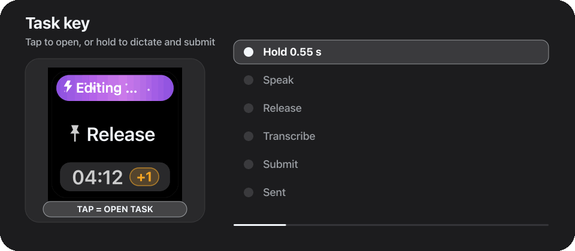

짧게 누르면 해당 작업을 엽니다. **0.55초 이상** 길게 누르고 `말하는 중` 표시가 나타난 뒤 말하세요. 느린 원격 전환에서는 정확한 작업과 작성창을 확인하는 동안 먼저 `전환 준비`가 표시됩니다. 버튼을 놓으면 녹음을 끝내고, 받아쓴 내용이 안정될 때까지 기다린 다음 Codex의 화면 보내기 컨트롤을 활성화합니다. 작성창이 실제로 비워졌음을 확인한 뒤에만 `전송 완료`를 표시합니다. ThreadDeck은 실제 Core Audio 출력을 내는 프로세스의 화면 앱을 찾아 의미가 확인된 일시정지 컨트롤만 누르고, 필요할 때만 macOS 정상 미디어 명령으로 폴백합니다. 선택한 작업 카드에 모든 단계가 나타납니다. 작업 전환과 작성창 활성화는 손쉬운 사용 포커스와 키보드로 처리하므로 마우스 포인터가 움직이지 않습니다.

### 전용 마이크: 초안만 받아쓰기

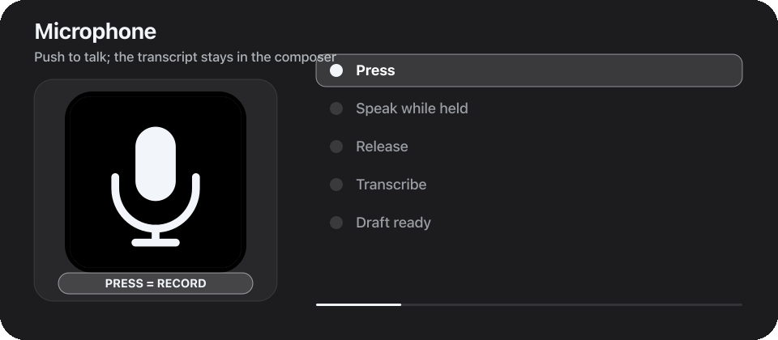

마이크 버튼은 누르는 즉시 녹음을 시작합니다. 말하는 동안 계속 누른 뒤 놓으세요. ThreadDeck은 받아쓰기를 끝내고, 자신이 일시정지한 지원 미디어만 재개한 뒤, 받아쓴 내용을 Codex 작성창에 남깁니다. 메시지를 **자동으로 전송하지 않습니다**. 내용을 확인한 뒤 보내기 버튼을 사용하세요. 화면에 추적 가능한 대상 작업이 있으면 해당 작업 카드에도 녹음 상태가 함께 나타날 수 있습니다.

### 보내기 버튼: Return 또는 Command+Return

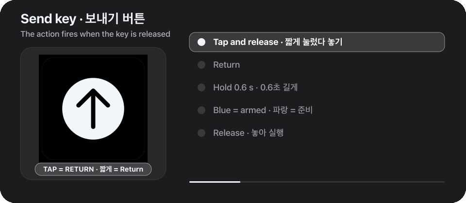

두 보내기 동작 모두 버튼을 놓는 순간 실행됩니다. 짧게 눌렀다 놓으면 Return입니다. 판정 기준은 누른 시간 **0.6초**이며, 파란 테두리는 긴 동작이 준비됐다는 확인 표시입니다. Command+Return을 확실히 보내려면 파란색을 본 뒤 놓으세요.

### 앱 실행 버튼: 열기 또는 종료

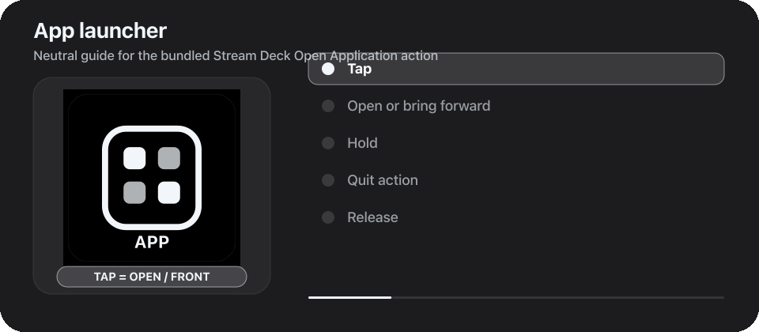

미디어 페이지의 Stream Deck, Music, Chrome, Codex 실행 버튼은 Elgato의 **Open Application** 액션입니다. 짧게 누르면 지정 앱을 열거나 앞으로 가져오고, 길게 누르면 앱을 종료합니다. 실제 버튼 그림과 길게 누르기 시간은 Stream Deck이 관리하므로 GIF는 앱 아이콘을 재배포하지 않고 중립적인 안내 버튼을 사용합니다. Stream Deck에서 원하는 앱으로 교체하고 길게 누르기 동작도 바꿀 수 있습니다.

## 작업 카드 읽는 법

| 예시 | 의미 |
|---|---|
| 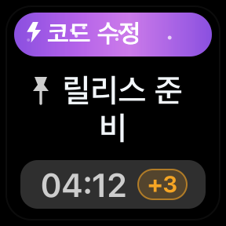 | 헤더는 현재 단계를 표시합니다. 핀은 제목 앞에, 시간은 1초마다 갱신되며 트랙과 번개는 **이미 실행 중인 응답**이 시작될 때 확정된 추론 강도와 Fast/일반 설정을 유지합니다. 시간 왼쪽의 과녁은 아직 끝나지 않은 목표이며, 이때 시간은 마지막 응답 한 번이 아니라 목표 전체 누적 시간입니다. 주황 `+N`은 관찰된 대기 후속 요청 개수입니다. |
| 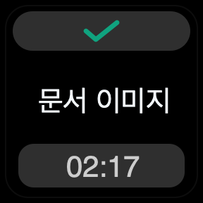 | 체크와 멈춘 시간은 최근에 관찰한 턴이 완료됐다는 뜻입니다. 완료 카드는 체크에 집중하도록 빠른 서비스 번개를 숨깁니다. 나중에 같은 작업을 다시 열어도 확정된 완료 시간은 덮어쓰지 않습니다. |
| 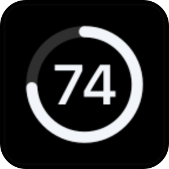 | CodexBar에서 읽은 선택 기능인 주간 잔량입니다. 페이지 전환 시 마지막 정상 값이 즉시 나타나고 일시적인 갱신 실패에도 유지됩니다. |
| 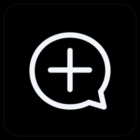 | 작업 카드와 같은 라이트·다크 시각 체계를 사용하는 작업 흐름 버튼입니다. |

작업 상태는 진행 중인 파랑·보라, 현재 단계, 고정 핀, 움직이거나 멈춘 시간, 주황 대기 개수, 완료 체크, 오류·중지, 초록 완료 펄스로 일관되게 표시됩니다. 확인하지 않은 완료는 플러그인을 다시 시작해도 초록 호흡 효과가 유지되며 정확한 작업을 열어야 사라집니다. 라이트 모드에서도 정보 순서는 같습니다.

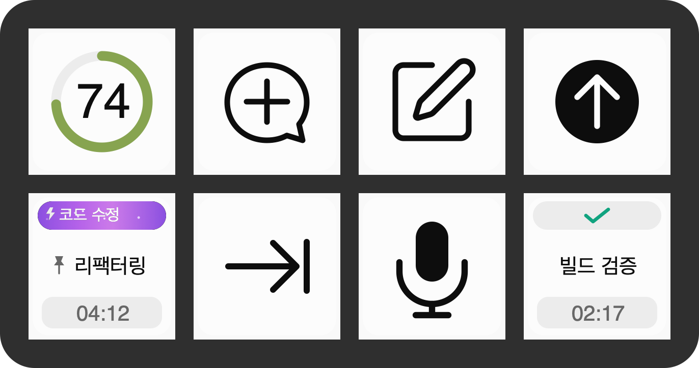

## 어떤 작업이 표시되나요?

ThreadDeck은 사용자에게 보여야 하는 작업만 최대 8개까지 채웁니다.

1. 고정·최근 **로컬 작업**;
2. 아래의 현재 작업 예외를 제외하고 Codex에서 사용자가 직접 고정한 **원격 작업**;
3. Codex 세션이 열려 있는 동안만 유지되는 임시 **사이드챗**.

고정하지 않은 원격 기록은 일반 상위 작업 슬롯을 차지하지 않습니다. 별도의 현재 작업 액션만 예외입니다. Codex 앱의 활성 창에 열린 원격 작업 하나는 이 버튼에 고정 여부와 관계없이 유지될 수 있습니다. 내부 보조·검토 작업은 제목을 렌더러에 넘기기 전에 구조 메타데이터로 제외합니다. 보관된 영구 작업 ID가 프롬프트 기록을 통해 가짜 사이드챗으로 다시 들어오는 경로도 차단합니다.

원격 작업을 표시하려면 Codex에서 해당 컴퓨터를 한 번 열어 요약을 로컬에 동기화한 뒤, Stream Deck에 둘 작업만 직접 고정하세요. 버튼을 누르면 Codex가 노출한 정확한 작업 UUID를 우선하고, 검증된 사이드바 또는 하나뿐인 통합 검색 결과를 키보드로 활성화해 컴퓨터와 작업을 함께 전환합니다. 이미 알려진 같은 제목은 엄격한 UUID 일치를 요구하며, Codex가 충분한 식별 정보를 노출하지 않으면 임의로 고르지 않고 `제목 중복`을 표시합니다.

<details>
<summary><strong>원격 상태·시간·추론 강도를 보수적으로 표시하는 방법</strong></summary>

원격 요약의 갱신 시각은 정렬에만 사용하며 완료 시각으로 만들지 않습니다. 턴의 UUIDv7 ID에서 시작 시각을 복원하고 명시적인 종료 이벤트 또는 실시간으로 확인한 active-to-not-loaded 전환에서만 소요 시간을 고정합니다. 목표 시간은 Codex 자체 누적 시간과 같은 규칙을 사용합니다. `active`에서만 증가하며 일시중지·차단·한도 제한·달성·중단·오류·확인된 원격 대기 상태에서는 최초 확정값에 멈춥니다. 자동 목표 진행이 새 턴을 시작하면 턴 사이의 임시 정지는 즉시 풀립니다. 화면에 열린 원격 목표는 Codex의 고정 상태 문구와 짧은 시간 또는 토큰 진행 값만 정확히 대조하며 목표 내용이나 대화 원문은 읽어 내보내지 않습니다. 마지막으로 관찰한 원격 상태와 시간은 플러그인 재시작 뒤에도 배지가 사라지지 않도록 최대 7일 동안 로컬에 보관합니다. 한 번도 화면에 열지 않은 원격 목표는 Codex 요약 정보만으로 추정하지 않습니다. 토큰 예산형 목표가 누적 시간을 화면에 내놓지 않으면 과녁은 유지하되 차단 뒤에도 숫자가 오르는 것처럼 보이지 않도록 `--:--`로 표시합니다. 새로 시작한 뒤 신뢰할 종료값이 없으면 임의의 짧은 시간 대신 알 수 없음으로 표시합니다. 중간 reasoning summary는 원문을 표시하거나 저장하지 않고 `계획 중`, `분석 중`, `구현 중`, `검증 중`, `실행 중`, `정리 중` 같은 개인정보 안전 단계로만 줄입니다. 추론 강도와 고속·일반 속도는 정확한 원격 작업에 연결된 명시적 메타데이터 또는 화면에 열린 작업의 정확한 작성창 일치값만 사용합니다. 실시간 관찰값은 해당 작업의 정확한 턴에만 묶어 보관하므로 다른 작업이나 다음 턴으로 새지 않으며, 의미가 모호한 요약의 `mode` 필드는 의도적으로 속도로 추정하지 않습니다. 신뢰할 값이 있을 때만 작업 카드 번개와 Fast mode 액션이 일치하며, 그렇지 않으면 임의로 추정하지 않고 알 수 없음으로 둡니다. 작업 전환 뒤의 상태 조회는 모델 선택기를 열지 않습니다. 닫힌 선택기의 번개는 Codex가 손쉬운 사용 텍스트에서 숨긴 별도 SVG이므로, ThreadDeck은 닫힌 버튼에서 추론 강도만 읽고 속도는 정확한 작업의 기록 또는 마지막 검증값으로 유지합니다. 모델 메뉴는 Fast mode나 추론 강도 버튼을 직접 누를 때만 열립니다.

</details>

## 포함된 Neo 프로필

기본 프로필은 3페이지이며 Stream Deck에서 자유롭게 재배치할 수 있습니다.

1. **대시보드** — 위쪽에 한도, 새 작업, 사이드챗, 보내기; 아래쪽에 현재 작업, 추론 강도+Fast, 마이크, 뒤로가기를 배치합니다. 결합 버튼은 `1,1`, 현재 작업은 `0,1`에 있으며 Fast 전용 액션도 사용자 지정 레이아웃용으로 남아 있습니다.
2. **작업** — 상위 작업 1~7과 뒤로가기. 상위 작업 8과 별도의 현재 작업 액션은 사용자 지정 레이아웃의 액션 목록에서 추가할 수 있습니다.
3. **미디어** — 이전 트랙, 되감기, 재생·일시정지, 앱 실행 4개, 뒤로가기. 다음 페이지, 다음 트랙, 탐색, 음소거, 음량 액션도 제공합니다.

Elgato 소유 앱 실행 키는 원래 그림과 설정된 길게 눌러 종료 동작을 유지하며 ThreadDeck 완료 효과를 받지 않습니다. ThreadDeck 페이지 이동 키에는 완료 효과가 적용됩니다.

## 선택 기능: 주간 한도 링

주간 한도 버튼을 제외한 모든 기능은 CodexBar 없이 작동합니다.

```sh
brew install --cask codexbar
codexbar usage --format json
```

[CodexBar](https://github.com/steipete/CodexBar)를 한 번 열어 제공자 설정에서 Codex를 켜고 위 명령이 JSON을 반환하는지 확인하세요. 일반적인 Homebrew 경로는 자동으로 찾으며 사용자 지정 설치에만 `CODEXBAR_PATH`가 필요합니다. ThreadDeck 페이지가 하나라도 보이는 동안 값을 미리 읽고 마지막 정상 결과를 유지합니다.

## 로컬 우선 설계와 개인정보 경계

ThreadDeck에는 계정, 텔레메트리, 분석 도구, 업데이트 서버, 클라우드 백엔드가 없습니다. 원격 Mac과 직접 통신하지도 않습니다. 원격 카드는 Codex Desktop이 이미 로컬에 캐시한 메타데이터에서 만듭니다.

| 데이터 소스 | 접근 | 목적 |
|---|---|---|
| `~/.codex`, `config.toml`, `models_cache.json`, Codex Desktop 로그 | 읽기 전용 | 사용자 작업 제목, 고정, 캐시된 원격 요약, 수명 주기, 목표 상태와 누적 시간, 활동, 시간, 서비스 메타데이터, 임시 사이드챗 수명 주기, 전역 노출·모델 지원 Effort 목록 |
| `~/Library/Application Support/ThreadDeck/remote-goals-v1.json` | 로컬 읽기·쓰기 | 최대 7일 동안 마지막으로 관찰한 원격 목표 상태와 숫자 시간만 보관; 목표 내용·제목·대화 원문은 저장하지 않음 |
| `~/Library/Application Support/ThreadDeck/unread-completions-v1.json` | 로컬 읽기·쓰기 | 확인하지 않은 완료 표시를 위한 작업 UUID와 숫자형 완료·알림 시각만 보관; 제목·대화 원문은 저장하지 않음 |
| `~/Library/Application Support/ThreadDeck/media-pause-lease-v1.plist` | 임시 로컬 읽기·쓰기 | 현재 음성 입력이 멈춘 미디어 앱의 번들 식별자만 보관; 10분 뒤 만료되며 제목·URL·PID·미디어 문구는 저장하지 않음 |
| 임의의 `127.0.0.1` 포트에 열린 Codex 렌더러 연결 | 로컬 읽기·제어 | 현재 작업, 다음 Effort/Fast, 테마, Micro 슬롯 최대 6개를 읽고 실제 ThreadDeck 물리 동작 뒤에만 Codex Micro 이벤트 전송 |
| `codex-micro-bootstrap-v1.json`, `codex-micro-bridge.json` | 로컬 읽기·쓰기 | 프로세스 세대, 루프백 포트, 건강 상태, 재시도 간격, 숫자 시각만 저장; 제목·프롬프트·받아쓰기·인증 정보 없음 |
| CodexBar CLI | 선택 하위 프로세스 | 남은 주간 한도만 확인; CodexBar의 제공자 동작은 별개 |
| Stream Deck 플러그인 소켓 | 로컬호스트 | 버튼 이벤트 수신과 렌더링 이미지 전송 |
| macOS 손쉬운 사용과 Core Audio | 로컬 시스템 API | 키보드·미디어 동작, 작성창 확인, 고정된 목표 상태·시간 문구, 대기 개수, 원격 선택, 음성 입력 중 오디오 처리 |

ThreadDeck은 Codex DB와 세션 파일에는 쓰지 않지만, 사용자가 물리 버튼을 누르면 의도대로 Codex UI를 열거나 받아쓴 메시지를 전송할 수 있습니다. 원격 제목은 명령행 인수가 아니라 표준 입력으로 네이티브 헬퍼에 전달합니다. 대기 메시지 본문과 임의의 손쉬운 사용 텍스트는 반환·기록·저장하지 않습니다. 물리 장치를 볼 수 있는 사람은 버튼에 표시된 작업 제목을 볼 수 있으므로, 로그나 사진을 공유하기 전에 [보안과 개인정보 안내](SECURITY.ko.md)를 확인하세요.

## 빠른 문제 해결

| 증상 | 먼저 확인할 것 |
|---|---|
| 어떤 버튼도 동작하지 않음 | 버튼 경고 확인: `권한 필요`는 손쉬운 사용, `입력 권한`은 합성 키 입력, `Codex 점검`은 Codex 실제 조작 실패, `미디어 점검`은 활성 재생을 안전하게 제어하지 못한 상태입니다. ThreadDeck이 권한을 30초마다 다시 검사하고 실제 복구가 확인되면 동작 경고도 자동 해제합니다. |
| Effort/Fast에 `Codex 재실행` 표시 | Codex를 한 번 종료하고 다시 여세요. 설치 당시 이미 열린 세션은 보존하고 다음 정상 실행 뒤 루프백 Micro 연결을 붙입니다. 그동안 기존 방식 제어는 계속 사용할 수 있습니다. |
| 받아쓰기 중 Music이나 브라우저 소리가 계속 재생됨 | 최신 빌드로 업데이트하세요. 이제 앱 허용 목록 없이 활성 Core Audio 프로세스의 화면 앱과 의미가 확인된 재생·일시정지 컨트롤을 사용합니다. Apple Music과 Chrome·Safari YouTube를 실기 검증했습니다. |
| 한글 입력 상태에서 받아쓰기가 시작되지 않음 | Codex의 받아쓰기 시작이 `⌃⇧D`인지 확인; ThreadDeck은 입력 배열과 무관한 라틴 `D`를 전송 |
| 마이크 버튼을 놓아도 메시지가 전송되지 않음 | 정상 동작입니다. 전용 마이크는 초안만 남깁니다. 자동 제출은 작업 버튼을 길게 누르거나 이후 보내기 사용 |
| 작업 버튼을 길게 눌러도 녹음되지 않음 | 0.55초를 지나 `말하는 중`이 나올 때까지 누르고, Codex 마이크 권한과 `⌃⇧D` 확인 |
| 보내기 길게 누르기가 짧은 동작으로 처리됨 | 버튼이 파란색으로 바뀔 때까지 누른 뒤 놓기 |
| 미디어 페이지에서 앱이 종료됨 | 기본 Elgato 앱 실행 버튼은 길게 누르면 종료합니다. 열거나 앞으로 가져오기만 하려면 짧게 누르기 |
| 원격 작업이 목록에 없음 | Codex에서 해당 컴퓨터를 한 번 열고 표시할 작업을 직접 고정 |
| 원격 작업에 `제목 중복` 표시 | 작업 제목을 서로 다르게 만들거나 하나만 고정 |
| `상태를 읽지 못함` 표시 | 최신 베타로 업데이트하고 Codex와 Stream Deck 재시작; 일시적인 읽기 실패는 정상 목록을 유지하며 자동 재시도 |
| 주간 한도를 읽지 못함 | `codexbar usage --format json` 실행과 CodexBar의 Codex 제공자 활성화 확인 |

첫 확인으로 해결되지 않으면 전체 [문제 해결 가이드](docs/TROUBLESHOOTING.ko.md)를 확인하세요.

## 빌드와 문서 미디어 재현

Node.js 20 이상, pnpm, Xcode Command Line Tools, Stream Deck이 필요합니다.

```sh
pnpm install --frozen-lockfile
pnpm run build
pnpm run audit
pnpm run check
pnpm run pack
```

네이티브 헬퍼는 Apple silicon과 Intel을 모두 지원하는 범용 바이너리로 만들어지며, 설치 파일은 `release/`에 생성됩니다. 문서 이미지와 5개의 GIF는 저장소의 렌더러와 문서 파이프라인에서 다시 만들 수 있습니다.

```sh
pnpm run render-docs
pnpm run render-animation
```

GIF 파이프라인은 Node.js와 빌드 전용 Sharp 의존성으로 SVG를 래스터화한 뒤 저장소의 Swift·ImageIO 헬퍼로 인코딩합니다. Sharp는 런타임 플러그인에 포함되지 않으며 복제한 제품 UI도 들어가지 않습니다.

## 현재 제한사항

- 공개 베타는 macOS와 Stream Deck Neo만 대상으로 하며 영어·한국어는 Stream Deck 언어에 맞춰 자동 선택합니다.
- 작업과 사이드챗 감지는 Codex의 비공개 파일·로그 형식에 의존하므로 Codex 릴리스 직후 잠시 어긋날 수 있습니다.
- 네이티브 제어는 비공개 Codex Micro 렌더러 API에 의존합니다. 연결은 임의의 루프백 포트에만 바인딩하며 Micro 동작이 전달되지 않았다고 확정할 수 있을 때만 기존 방식으로 폴백합니다.
- Codex가 노출하는 Micro 작업 슬롯은 6개입니다. ThreadDeck은 별도 8개 카드 모니터를 유지하고, 남은 두 슬롯이나 Micro에 배정되지 않은 작업은 기존 검증형 전환 경로를 사용합니다.
- 대기 개수는 현재 열린 작업에서 관찰하며 한국어·영어 손쉬운 사용 라벨을 인식합니다.
- 단축키 액션은 현재 위에 적은 Codex 키 지정을 전제로 합니다.
- 활성 미디어는 앱 허용 목록이 아니라 Core Audio 출력에서 찾습니다. 의미가 확인된 일시정지·재생 컨트롤을 우선하고 필요할 때만 macOS 정상 미디어 명령으로 보수적으로 폴백하며, 마지막 음성 버튼을 놓은 뒤 자신이 멈춘 앱만 재개합니다. 브라우저 세션은 여러 탭을 대표할 수 있습니다.
- 사용자 설정 단축키와 다른 Stream Deck 모델 지원은 이후 베타에서 계획하고 있습니다.

## 프로젝트 문서

- [문제 해결](docs/TROUBLESHOOTING.ko.md) · [English](docs/TROUBLESHOOTING.md)
- [다른 Mac 설치](docs/INSTALL.ko.md) · [English](docs/INSTALL.md)
- [보안과 개인정보](SECURITY.ko.md) · [English](SECURITY.md)
- [구조 설명](docs/ARCHITECTURE.ko.md) · [English](docs/ARCHITECTURE.md)
- [플랫폼 이식](docs/PORTING.ko.md) · [English](docs/PORTING.md)
- [오픈소스 구성표](docs/OPEN_SOURCE.ko.md) · [English](docs/OPEN_SOURCE.md)
- [브랜드 가이드](docs/BRAND.ko.md) · [English](docs/BRAND.md)
- [관련 프로젝트](docs/ALTERNATIVES.ko.md) · [English](docs/ALTERNATIVES.md)
- [기여 안내](CONTRIBUTING.ko.md) · [English](CONTRIBUTING.md)
- [지원 안내](SUPPORT.ko.md) · [English](SUPPORT.md)
- [변경 기록](CHANGELOG.ko.md) · [English](CHANGELOG.md)

## 라이선스와 상표

ThreadDeck은 MIT 라이선스로 제공되는 독립 비공식 프로젝트이며 OpenAI 또는 Elgato와 관련·제휴·후원 관계가 없습니다. 상표와 자산 고지는 [한국어 고지](NOTICE.ko.md)를 참고하세요.
