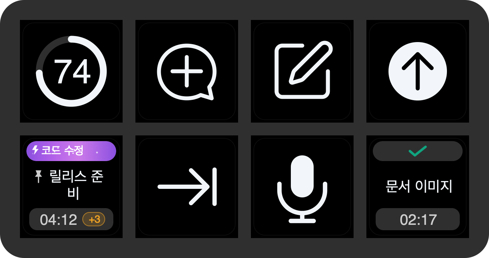

<p align="center">
  
</p>

<h1 align="center">ThreadDeck for Codex</h1>

<p align="center"><strong>Codex tasks, at a glance.</strong></p>

<p align="center">
  A local-first Stream Deck Neo dashboard for Codex Desktop on macOS.<br>
  See live tasks, jump between them, and control the everyday actions around your workflow.
</p>

<p align="center">
  <a href="https://github.com/y5862000/threaddeck-for-codex/releases"></a>
  <a href="https://github.com/y5862000/threaddeck-for-codex/actions/workflows/ci.yml"></a>
  <a href="LICENSE"></a>
  
  
</p>

<p align="center"><a href="README.ko.md">한국어</a> · <a href="#quick-start">Quick start</a> · <a href="https://github.com/y5862000/threaddeck-for-codex/releases">Download</a></p>

The following feature overview is generated directly by the plugin's real key renderer; it uses sanitized demonstration tasks rather than copied product artwork.



The animated demo is generated by that same renderer. It shows an active Ultra/fast task, a queued follow-up advancing, task-key push-to-talk, automatic submission after transcription, and the coordinated completion pulse.


> [!IMPORTANT]
> ThreadDeck is an independent beta that reads undocumented local Codex metadata. A Codex update can temporarily break task detection. ThreadDeck never writes to Codex state.

## Why ThreadDeck

Codex can keep several long-running tasks moving at once, but the desktop app is still the place you have to look to know what is happening. ThreadDeck moves the small, high-frequency checks onto hardware:

- Which task is working, waiting, completed, queued, or in error?
- How long has it been running, and how long did it take?
- Which pinned or recent task do I want to open next?
- How much weekly capacity is left?
- Can I start a task, open Side Chat, dictate, send, or switch apps without hunting for a shortcut?
- Can I hold the task I am watching, speak a follow-up, and have it submitted to that task when I release the key?

It is designed for the eight keys and InfoBar of Stream Deck Neo, not merely squeezed into that form factor.

## What you can see

| | Key | What it communicates |
|---|---|---|
|  | Weekly quota | Remaining weekly capacity as a neutral monochrome ring that follows the system appearance. Requires the optional CodexBar helper. |
|  | Live task | Current activity, pinned state, task title, elapsed time, reasoning intensity, and fast/standard tier cues. |
|  | Completed task | A clear completion mark and the final task duration. A completion triggers a visible pulse across ThreadDeck keys. |
|  | Workflow action | Native-feeling shortcuts for Side Chat, new task, push-to-talk, send, app switching, and media control. |

Task cards follow the same visual grammar in light appearance:


## Included Neo layout

The bundled profile contains three pages. You can rearrange the supplied actions in Stream Deck at any time.

1. **Dashboard** — weekly quota, one live task, new task, Side Chat, push-to-talk, send, app switcher, and ThreadDeck back navigation.
2. **Tasks** — task slots 1 through 7 plus ThreadDeck back navigation. The plugin exposes an eighth task action if you want a different layout.
3. **Media** — previous track, rewind, play/pause, four app launchers, and ThreadDeck back navigation. Additional forward-page, next-track, seek, mute, and volume actions are available in the action list.

### Task state language

- **Blue or purple capsule:** work is active. Color and subtle motion indicate reasoning intensity and service tier.
- **Activity text:** the current phase, such as thinking, editing, running a tool, searching, or verifying.
- **Pin before title:** the task is pinned in Codex.
- **Running timer:** elapsed time updates every second while the task is active.
- **Amber `+N` badge:** queued follow-ups detected for that task.
- **Check and fixed timer:** the task completed and the final duration is frozen.
- **Green completion pulse:** all visible ThreadDeck actions acknowledge completion; the matching task pulses longer and more strongly.
- **Queue-advance pulse:** when Codex starts the next queued follow-up, the reduced queue count is acknowledged as another completed turn.

## Quick start

### Requirements

- macOS 13 or later. The optional CodexBar quota helper currently requires macOS 14 or later.
- Stream Deck 7.4 or later.
- Stream Deck Neo.
- Codex Desktop installed as `com.openai.codex`.

### Install

1. Download `com.yechan.threaddeck.streamDeckPlugin` from the [releases page](https://github.com/y5862000/threaddeck-for-codex/releases). Beta releases are marked as pre-releases.
2. Double-click the file and approve installation in Stream Deck.
3. Import the bundled **ThreadDeck for Codex** Neo profile when prompted.
4. In **System Settings → Privacy & Security → Accessibility**, allow **Stream Deck**. This is required for keyboard/media actions and the local queue counter.
5. In Codex Desktop, open **Settings → Keyboard Shortcuts**, check the shortcuts below, and explicitly assign push-to-talk to `⌃⇧D`.
6. Open Codex Desktop and test a task key and the microphone key to confirm both navigation and dictation.

### Required Codex shortcut setup

The current beta sends the following fixed key combinations. If your Codex shortcuts differ, the matching ThreadDeck actions will not work. Setting names may vary slightly between Codex versions and localizations.

| Codex function | Keys sent by ThreadDeck | Used by |
|---|---:|---|
| Voice input / push-to-talk | `⌃⇧D` | Dedicated microphone key and long-press task dictation |
| Open a new task outside the project | `⌥⌘O` | New task key |
| Open Side Chat | `⌥⌘S` | Side Chat key |

> [!IMPORTANT]
> Voice input is not configured automatically. Assign `Control+Shift+D` in Codex before using it. If pressing the microphone key only types `D` or does nothing, check this shortcut and Stream Deck's Accessibility permission first.

The public plugin uses its own identifier and will not overwrite the author's private development prototype.

### Optional weekly quota ring

ThreadDeck uses [CodexBar](https://github.com/steipete/CodexBar) only for the weekly quota key. Every other feature works without it.

```sh
brew install --cask codexbar
codexbar usage --format json
```

Open CodexBar once, enable Codex in its provider settings, and confirm the command returns JSON. ThreadDeck searches common Homebrew paths automatically; set `CODEXBAR_PATH` only for a custom installation.

## Actions and shortcuts

| Action | Default behavior |
|---|---|
| Open task | A short press opens the selected task through its local `codex://` URL. Hold for 0.55 seconds to open it and start push-to-talk; release to stop recording, wait for transcription, and submit the ordinary follow-up automatically. |
| New task | Sends `⌥⌘O`, opening a task outside the current project with the current Codex shortcut. |
| Side Chat | Sends `⌥⌘S`. |
| Push-to-talk | Holds `⌃⇧D` for exactly as long as the Stream Deck key is held. Active audio-producing apps are temporarily suspended and resumed on release. |
| Send | Short press sends Return; holding for 0.6 seconds and releasing sends Command+Return. The key turns blue when the long-press action is armed. |
| App switcher | Holds Command and taps Tab for a native app switch. |
| Media | Previous/next, seek, play/pause, mute, and volume actions are available. |

Task-key dictation shows recording, transcription, submission, success, and error states on both the dedicated microphone key and the selected task card. A short task-key press remains ordinary navigation. Side Chats are treated as temporary tasks: they can be monitored while open and disappear from task slots after Codex closes them.

If you changed a Codex shortcut, update the corresponding constants in `native/keybridge.m` and rebuild. Configurable shortcuts are planned for a later beta.

## Local-first by design

ThreadDeck has no account, telemetry, analytics, update server, or cloud backend.

| Source | Access | Purpose |
|---|---|---|
| Codex files and Desktop logs under `~/.codex` | Read-only | Task titles, pins, status, activity, timing, service metadata, and temporary Side Chat lifecycle. |
| CodexBar CLI | Child process, optional | Weekly remaining quota only. |
| Stream Deck plugin WebSocket | Localhost | Receives key events and sends rendered key images. |
| macOS Accessibility / Core Audio | Local system APIs | Keyboard shortcuts, media keys, push-to-talk audio handling, and a privacy-preserving count of visible Codex queue actions. |

Queue detection hashes the current Codex window title and localized queue-action labels inside the native helper. It returns only hashes and counts to the plugin; queued message text is never returned, logged, or stored. ThreadDeck never writes to Codex databases or session files. Read [SECURITY.md](SECURITY.md) before attaching logs or screenshots to an issue.

## Fully open source

The complete ThreadDeck implementation is published under the [MIT License](LICENSE):

- dependency-free Node.js plugin source;
- Objective-C source for the universal macOS keyboard/media helper;
- unpacked Stream Deck Neo profile source;
- original ThreadDeck mark and generated documentation images;
- build, audit, verification, packaging, and documentation-rendering scripts.

The release package can be rebuilt from this repository. Codex Desktop and Stream Deck are proprietary external applications required at runtime; they are not bundled or covered by this repository's license. See [docs/OPEN_SOURCE.md](docs/OPEN_SOURCE.md) for the exact source-to-artifact map and third-party boundary.

## Build from source

Install Node.js 20+, pnpm, Xcode Command Line Tools, and Stream Deck. Then:

```sh
pnpm install --frozen-lockfile
pnpm run build
pnpm run audit
pnpm run check
pnpm run pack
```

The installer is written to `release/`. The native helper is compiled from `native/keybridge.m` as a universal Apple silicon + Intel binary. To regenerate the README images from the real key renderer:

```sh
pnpm run render-docs
pnpm run render-animation
```

The animated renderer uses macOS `sips`, Swift, and ImageIO, so it requires no third-party GIF encoder.

Read [docs/ARCHITECTURE.md](docs/ARCHITECTURE.md) for the data flow and [CONTRIBUTING.md](CONTRIBUTING.md) for development guidance.

## Known limitations

- macOS and Stream Deck Neo only in the first public beta.
- The key UI is Korean-first.
- Task and Side Chat detection depend on private Codex file/log formats and can lag behind a Codex release.
- Queue counts are observed from the currently open Codex task and retained on its key; the initial release recognizes Korean and English Codex accessibility labels.
- The current shortcut actions assume Codex's default shortcuts listed above.
- The weekly quota ring depends on a separately installed CodexBar.
- Elgato-owned app-launch keys keep their native rendering and do not receive ThreadDeck's completion overlay. The bundled previous-page keys are ThreadDeck actions and do receive it.

Start with [Troubleshooting](docs/TROUBLESHOOTING.md), then use the repository's issue templates if the problem remains.

## Related work

ThreadDeck is not the first Codex-related Stream Deck project. [Codex Deck](https://github.com/dazer1234/codex-stream-deck) is a capable Codex Micro controller, while other open-source and Marketplace plugins focus on AI quota monitoring. ThreadDeck's narrower goal is a physically tested Neo dashboard for Codex Desktop tasks. See [docs/ALTERNATIVES.md](docs/ALTERNATIVES.md) for a comparison.

## Project documents

- [Brand guide](docs/BRAND.md) · [한국어](docs/BRAND.ko.md)
- [Open-source inventory](docs/OPEN_SOURCE.md) · [한국어](docs/OPEN_SOURCE.ko.md)
- [Architecture](docs/ARCHITECTURE.md) · [한국어](docs/ARCHITECTURE.ko.md)
- [Troubleshooting](docs/TROUBLESHOOTING.md) · [한국어](docs/TROUBLESHOOTING.ko.md)
- [Related projects](docs/ALTERNATIVES.md) · [한국어](docs/ALTERNATIVES.ko.md)
- [Contributing](CONTRIBUTING.md) · [한국어](CONTRIBUTING.ko.md)
- [Security and privacy](SECURITY.md) · [한국어](SECURITY.ko.md)
- [Support](SUPPORT.md) · [한국어](SUPPORT.ko.md)
- [Changelog](CHANGELOG.md) · [한국어](CHANGELOG.ko.md)

## License and trademarks

ThreadDeck is available under the [MIT License](LICENSE). It is independent and unofficial, and is not affiliated with, endorsed by, or sponsored by OpenAI or Elgato. See [NOTICE.md](NOTICE.md) for trademark and asset notices.
