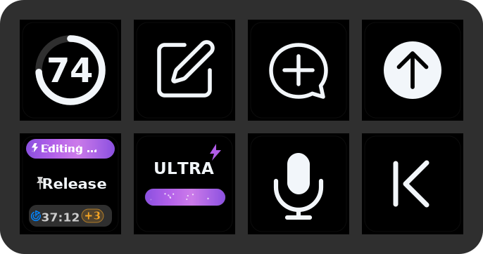

# ThreadDeck for Codex

An unofficial, Neo-first task dashboard for Codex Desktop on macOS.

ThreadDeck turns a Stream Deck Neo into a glanceable Codex companion: it shows pinned and recent tasks, live work state, elapsed time, completion pulses, weekly quota, reasoning/speed cues, and opens a task with one press.



> **Beta:** the plugin reads undocumented local Codex metadata. A Codex update can temporarily break task detection. It never writes to Codex state.

## What it does

- Includes eight configurable task actions; the bundled Neo profile shows seven pinned/recent Codex tasks with live working, completed, queued, and error states.
- Displays elapsed time while working and the final duration after completion.
- Visualizes reasoning effort and fast/standard service tier without filling the key with labels.
- Pulses every visible ThreadDeck-owned key when any task completes, with a longer and stronger pulse on that task. Elgato-owned page and app actions keep their native behavior and appearance.
- Opens a selected Codex task by its `codex://` link.
- Opens a new task outside the current project, opens Side Chat, holds push-to-talk, sends the current prompt, and switches apps.
- Shows weekly remaining quota as a color-changing ring through CodexBar.
- Provides previous/next, seek, play/pause, mute, and volume actions; the bundled third page uses a compact three-key media set alongside four app launchers.
- Follows macOS light/dark appearance.

The bundled Neo profile has three pages:

1. **Dashboard** — quota, one task card, new task, Side Chat, push-to-talk, send, app switcher, and native back navigation.
2. **Tasks** — task slots 1 through 7 plus native back navigation.
3. **Media** — previous/play-pause/next, four app launchers, and native back navigation.

## Requirements

- macOS 13 or later. CodexBar itself currently requires macOS 14 or later.
- Stream Deck 7.4 or later.
- Stream Deck Neo.
- Codex Desktop installed as `com.openai.codex`.
- [CodexBar](https://github.com/steipete/CodexBar) for the quota key only.

Install CodexBar with Homebrew:

```sh
brew install --cask codexbar
```

Then open CodexBar once, enable Codex in its provider settings, and confirm the CLI works:

```sh
codexbar usage --format json
```

## Install a release

1. Download `com.yechan.threaddeck.streamDeckPlugin` from Releases.
2. Double-click it and approve installation in Stream Deck.
3. Accept the bundled **ThreadDeck for Codex** Neo profile.
4. Allow **Stream Deck** under **System Settings → Privacy & Security → Accessibility**.

The public plugin uses a separate identifier from the author's private prototype, so it will not overwrite that development copy.

## Build from source

Install Node.js 20+, pnpm, Xcode Command Line Tools, and the Stream Deck app. Then:

```sh
pnpm install
pnpm run build
pnpm run check
pnpm run pack
```

The installer is written to `release/`. The native helper is built for both Apple silicon and Intel Macs.

## Privacy

ThreadDeck has no telemetry and no cloud service. It reads local task metadata under `~/.codex`, invokes your separately installed CodexBar CLI for quota data, and talks to Stream Deck over its localhost plugin WebSocket.

Push-to-talk temporarily suspends processes that macOS reports as actively producing audio, then resumes those same process IDs when the key is released. Read [SECURITY.md](SECURITY.md) for details.

## Known limitations

- macOS and Stream Deck Neo only in the first public beta.
- The UI is currently Korean-first.
- Task detection depends on private Codex file formats.
- New task (`⌥⌘O`), Side Chat (`⌥⌘S`), and push-to-talk (`⌃⇧D`) assume the current Codex shortcuts.
- The quota ring requires CodexBar; every other action works without it.

## Similar projects

This is not the first Codex-related Stream Deck project. [Codex Deck](https://github.com/dazer1234/codex-stream-deck) is a capable Codex Micro controller, while several open-source and Marketplace plugins focus on AI quota monitoring. ThreadDeck's narrower goal is a physically tested Neo dashboard for Codex Desktop tasks. See [docs/ALTERNATIVES.md](docs/ALTERNATIVES.md) for the comparison.

## License and trademarks

Source code is available under the [MIT License](LICENSE). See [NOTICE.md](NOTICE.md) for trademark and asset notices.
