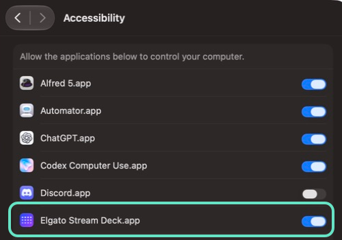

# 다른 Mac에 ThreadDeck 설치하기

> [English](INSTALL.md)

ThreadDeck은 하나의 한영 통합 Stream Deck 플러그인으로 배포됩니다. 같은 설치 파일이 Stream Deck 앱 언어가 영어면 영어, 한국어면 한국어를 자동으로 사용하므로 언어별 빌드를 따로 받을 필요가 없습니다.

## 준비 사항

- macOS 13 이상
- Stream Deck 7.4 이상
- Stream Deck Neo
- 번들 ID가 `com.openai.codex`인 Codex Desktop

Apple Silicon과 Intel Mac이 같은 설치 파일을 사용합니다. 다운로드 무결성을 확인하려는 사용자를 위해
각 릴리스에는 `com.yechan.threaddeck.streamDeckPlugin.sha256`도 함께 올라갑니다.

플러그인은 추천 **ThreadDeck for Codex** Neo 프로파일을 자동으로 설치합니다. 릴리스 빌드는 복구·수동 가져오기·편집 가능한 두 번째 복사본용 `threaddeck-for-codex-neo.streamDeckProfile`도 만들며, 자세한 내용은 [프로파일 안내](PROFILE.ko.md)를 확인하세요.

## 설치

1. [GitHub Releases](https://github.com/y5862000/threaddeck-for-codex/releases)에서 `com.yechan.threaddeck.streamDeckPlugin`을 받습니다.
2. 파일을 두 번 클릭하고 Stream Deck에서 설치를 승인합니다.
3. Stream Deck의 프로필 선택기에서 **ThreadDeck for Codex**를 선택합니다. 현재 프로필을 덮어쓰지 않고 별도로 설치됩니다.
4. **시스템 설정 → 개인정보 보호 및 보안 → 손쉬운 사용**에서 **Stream Deck**을 허용한 뒤 Stream Deck을 완전히 종료하고 다시 엽니다.

   

   최근 macOS에서는 **Elgato Stream Deck.app**으로 표시됩니다. 화면 기록·입력 모니터링·전체 디스크 접근 권한은 필요하지 않습니다. 스위치가 이미 켜져 있는데도 버튼에 권한 경고가 남아 있다면 한 번 껐다 켜고, 메뉴 바 아이콘에서 Stream Deck을 완전히 종료한 뒤 다시 여세요.

5. Codex를 종료한 뒤 평소처럼 한 번 실행합니다. ThreadDeck은 플러그인을 시작할 때 이미 열려 있던 Codex 프로세스를 의도적으로 건드리지 않습니다. 사용자가 나중에 정상 실행한 뒤 임의 루프백 Micro 연결을 붙이기 위해 Codex가 한 번 더 자동 재실행될 수 있습니다.
6. **Codex → 설정 → 키보드 단축키**에서 다음 폴백 값을 지정하거나 확인합니다.

| Codex 기능 | 단축키 |
|---|---:|
| 음성 입력 시작 | `Control+Shift+D` (`⌃⇧D`) |
| 현재 프로젝트 안에 새 작업 | `Shift+Command+O` (`⇧⌘O`) |
| 프로젝트 밖 새 작업 | `Option+Command+O` (`⌥⌘O`) |
| 사이드챗 열기 | `Option+Command+S` (`⌥⌘S`) |

7. 마이크 버튼을 누른 채 말한 뒤 놓습니다. 처음에는 Codex가 마이크 권한을 요청할 수 있습니다.

프로파일 메뉴에 **ThreadDeck for Codex**가 이미 있다면 복제본이 필요할 때가 아니면 독립 프로파일을 다시 가져오지 마세요. 예전 **Codex Neo**는 별도의 실험용 복사본이므로 유지되는 추천 프로파일이 정상 작동하는지 확인한 뒤 삭제해도 됩니다.

Micro 연결이 활성화되면 Effort, Fast mode, 사이드챗, 일반 보내기, 새 작업, 누르는 동안 말하기, 기본 작업 슬롯 6개는 Codex 자체 내부 이벤트를 사용합니다. 새 작업은 현재 작업 범위를 따라 같은 프로젝트 안에 생기거나 프로젝트 밖 상태를 유지합니다. 위 단축키는 호환 폴백을 위해 계속 중요합니다. ThreadDeck의 8개 카드 모니터, 대기열, 목표, 원격 작업, Micro 슬롯 밖 전환은 기존 읽기 전용 상태와 검증형 macOS 어댑터를 함께 사용합니다.

화면 기록과 전체 디스크 접근 권한은 필요하지 않습니다. 선택적인 사용량 버튼만 [CodexBar](https://github.com/steipete/CodexBar)가 필요하고, 나머지 기능은 단독으로 동작합니다.

## 버튼에 설정 경고가 뜨는 경우

ThreadDeck은 시작할 때와 30초마다 손쉬운 사용 및 키보드 이벤트 권한을 확인합니다. 권한이 없으면 macOS 공식 요청을 띄우고 복구될 때까지 버튼에 짧은 경고를 유지합니다.

Effort/Fast 버튼에 **Codex 재실행**이 표시될 수도 있습니다. 손쉬운 사용 문제가 아니라 현재 Codex 프로세스가 로컬 렌더러 연결보다 먼저 시작됐다는 뜻입니다. Codex를 한 번 종료하고 다시 여세요. 새 정상 실행에도 연결이 없으면 ThreadDeck이 해당 프로세스 세대에 한 번만 보호된 재실행을 수행하고, 이후 10분 동안 다시 시도하지 않습니다. Stream Deck을 시작하기 전에 `THREADDECK_DISABLE_MICRO_BOOTSTRAP=1`을 설정하면 자동 복구를 끌 수 있으며 기존 방식 제어는 계속 사용할 수 있습니다.

소스 체크아웃에서는 `pnpm run doctor`로 Micro 연결됨·Codex 재실행 필요·중지 상태까지 확인하는 읽기 전용 설치 진단을 실행할 수 있습니다. doctor는 두 앱을 시작·종료·수정하지 않습니다. 자세한 해결법은 [문제 해결](TROUBLESHOOTING.ko.md)을 확인하세요.

## 업데이트 또는 삭제

- 업데이트는 새 `.streamDeckPlugin` 파일을 기존 설치 위에 설치하면 됩니다.
- 삭제는 Stream Deck 플러그인 목록에서 **ThreadDeck for Codex**를 우클릭하고 **제거**를 선택합니다. Codex 데이터는 수정되지 않습니다.
