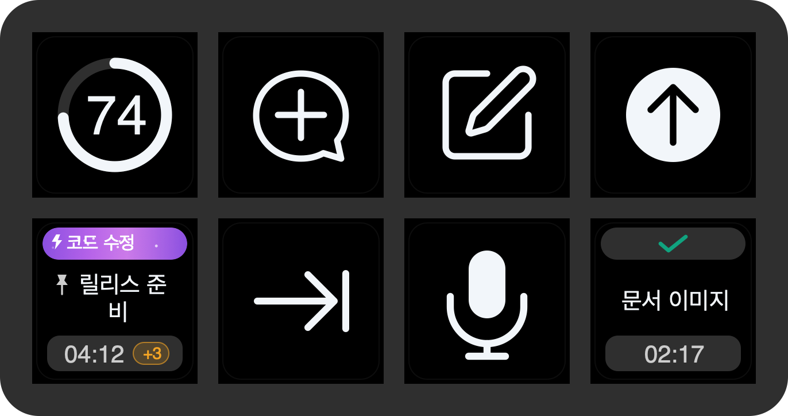

# Recommended Stream Deck Neo profile

> [Korean profile guide](PROFILE.ko.md)

ThreadDeck ships one editable, two-page Codex profile designed for the eight-key **Stream Deck Neo**. Its name in the Stream Deck profile menu is **ThreadDeck for Codex**.

## Get the profile

The recommended path is to install `com.yechan.threaddeck.streamDeckPlugin` from [GitHub Releases](https://github.com/y5862000/threaddeck-for-codex/releases). The plugin installs this profile automatically without replacing the profile you currently use.

The release pipeline also exports `threaddeck-for-codex-neo.streamDeckProfile` as a separate asset for recovery, manual import, or an editable second copy. The standalone profile still requires the ThreadDeck plugin for its Codex actions.

> [!NOTE]
> If **ThreadDeck for Codex** already appears in the profile menu, do not import the standalone file unless you intentionally want a duplicate. Older experimental profiles such as **Codex Neo** can remain installed, but they are not the maintained recommended profile.

## Page 1 — Dashboard

| Weekly quota | New task | Side Chat | Send |
|---|---|---|---|
| Current task | Effort + Fast | Microphone | Page navigation (Previous) |

This is the recommended everyday page: monitor the task selected in Codex, set the next response's Effort/Fast state, dictate, and send without changing pages.

The three top-row workflow keys are copies of the same **Codex command** action, configured as New task, Side Chat, and Send. The Current task key uses the configurable **Codex task** action.

## Page 2 — Tasks

| Top Task 1 | Top Task 2 | Top Task 3 | Top Task 4 |
|---|---|---|---|
| Top Task 5 | Top Task 6 | Top Task 7 | Page navigation (Previous) |

Every task key on this page is another copy of the same **Codex task** action with Top 1–7 selected in its Property Inspector. Add another copy and choose Top 8 for a custom layout.

## Customize safely

- Duplicate the profile in Stream Deck before making a large rearrangement.
- Select a key to change its Task slot or Command in the autosaving Property Inspector.
- Keep the bundled ThreadDeck **Page navigation** key if you retain both pages. It is also available in the ThreadDeck action list, lets you choose Previous or Next, and follows light/dark appearance unlike Stream Deck's generic navigation actions.
- The profile source is hardware-UUID-free and lives under [`profiles/source/unpacked`](../profiles/source/unpacked).
- The release audit verifies the Neo model and every recommended key coordinate before publishing.
